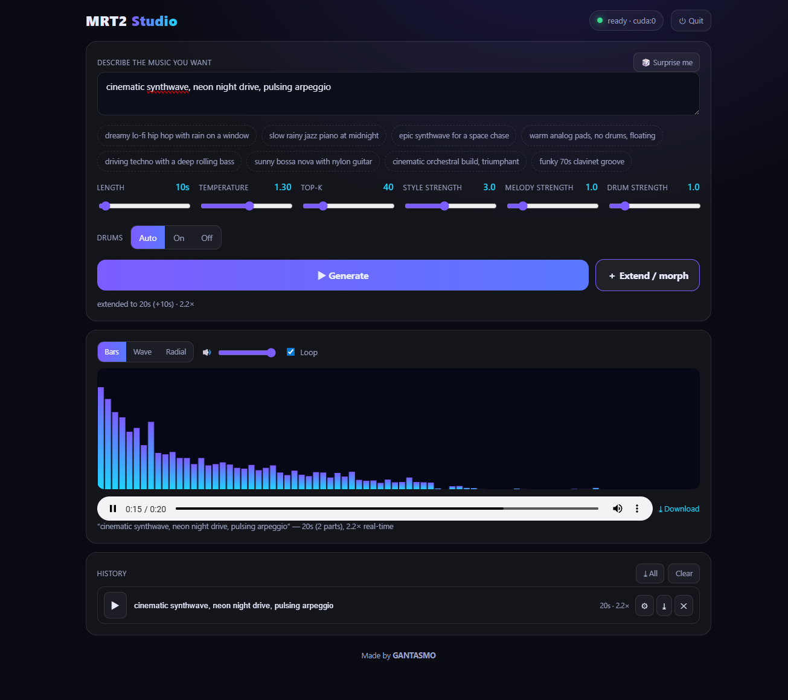
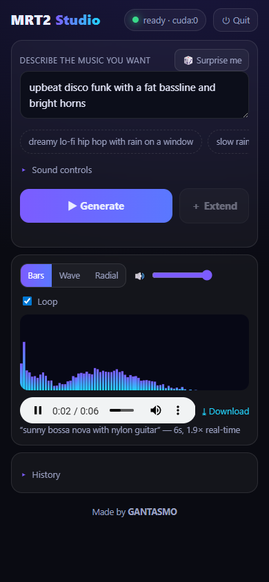

# magenta-rt2-nvidia

NVIDIA/CUDA port of Magenta RealTime 2: a one-click local studio that runs `mrt2_small`
on a WSL2 GPU via JAX and serves a browser UI for prompt-to-audio generation (48 kHz
stereo, ~2× real-time). Includes WSL2 setup scripts and an optional RunPod serverless
path for `mrt2_base`.

Made by **[GANTASMO](https://gantasmo.com)**.

## Requirements

- **Windows 10 or 11** with an **NVIDIA GPU** (the installer enables WSL2 if needed), or a
  Linux host with an NVIDIA GPU.
- About **6 GB** of free disk space and an internet connection for first-time setup.
- The `mrt2_small` model runs locally. The larger `mrt2_base` model runs on a RunPod cloud GPU.

New to "WSL"? The installer turns it on for you. Full walkthrough: **[INSTALL.md](INSTALL.md)**.

## ⬇️ Get started (easiest, no terminal)

1. **[Download the latest release ZIP](../../releases/latest)** (`MRT2-Studio.zip`).
2. Unzip it anywhere (your Desktop is fine).
3. Double-click **`Setup-MRT2.bat`**. It checks your PC, tells you exactly what it needs
   and how big the downloads are, **asks before downloading anything**, and fixes common
   problems automatically.
4. When it finishes, the Studio opens in your browser. Type a vibe, press **Generate**.

After the first time, just double-click **`oneclick\studio\MRT2-Studio.vbs`**.

## Features

- **Generate** from a text prompt. Length up to 3 minutes, plus temperature, top-k, style strength, and melody strength.
- **Extend / morph**: continue the current piece seamlessly; change the prompt first and it morphs into a new vibe without a hard cut.
- **Drums**: Auto / On / Off, with a separate drum-strength control.
- **Live visualizer**: Bars, Wave, or Radial, reacting to the audio in real time.
- **Player tools**: master volume, loop, per-track download, and a history (kept across reloads) that can be renamed, reused, re-downloaded, or cleared.
- **Any screen**: a compact, collapsible layout that fits one phone screen and expands on desktop.

Every track is also saved to `oneclick\studio\output\`.

> ## ⚠️ Read this if you're cloning or using GitHub's "Download ZIP"
> This project links the upstream engine source as a **git submodule** (`port_src/`).
> GitHub's green **Code → Download ZIP** button and a plain `git clone` leave that folder
> **empty**.
>
> **The app does not require `port_src/`.** The simple fix, no terminal required:
> **use the [release ZIP](../../releases/latest)** above. It contains everything the app
> needs. (Developers who specifically want the C++ engine source: clone with
> `git clone --recurse-submodules https://github.com/gantasmo/magenta-rt2-nvidia`.)

## Layout

| Path | Contents |
|---|---|
| `Setup-MRT2.bat` / `setup.ps1` | the installer/doctor (system + dependency checks, auto-fix) |
| `port/oneclick/` | the one-click Studio app and the RunPod cloud path |
| `port/wsl/` | WSL2 GPU setup and generation scripts |
| `port/server/` | streaming server |
| `port/` | CUDA port kit (Dockerfile, build scripts) |
| `port_src/` | upstream Magenta RealTime engine source (git submodule, Apache-2.0) |

## Packaging

Run `package.ps1` to build the distributable zip into `dist/MRT2-Studio.zip`.

## License

MIT. See [LICENSE](LICENSE). Built on Magenta RealTime 2 (Apache-2.0, © Google LLC);
see [THIRD_PARTY_NOTICES.md](THIRD_PARTY_NOTICES.md) for attribution and model-weight terms.

## Credits

MRT2 Studio is an NVIDIA/CUDA port of [Magenta RealTime 2](https://github.com/magenta/magenta-realtime),
built by [GANTASMO](https://gantasmo.com) as part of [theDAW](https://github.com/gantasmo). It was created
at the [Music Hackspace](https://musichackspace.org/) [Music Technology Hackathon](https://musichackspace.org/events/hackathon-boston-june-2026)
at Berklee College of Music.
